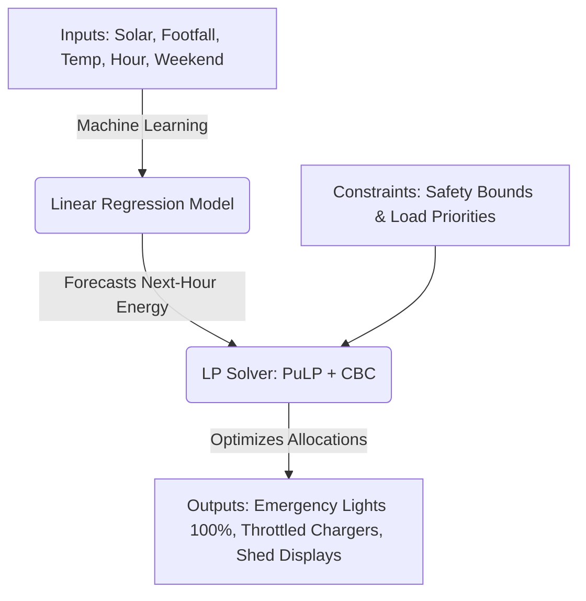
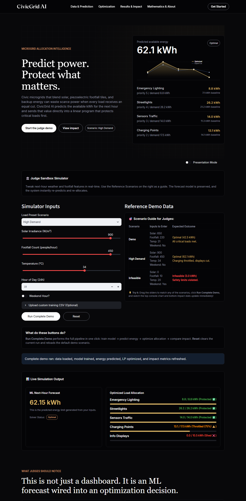
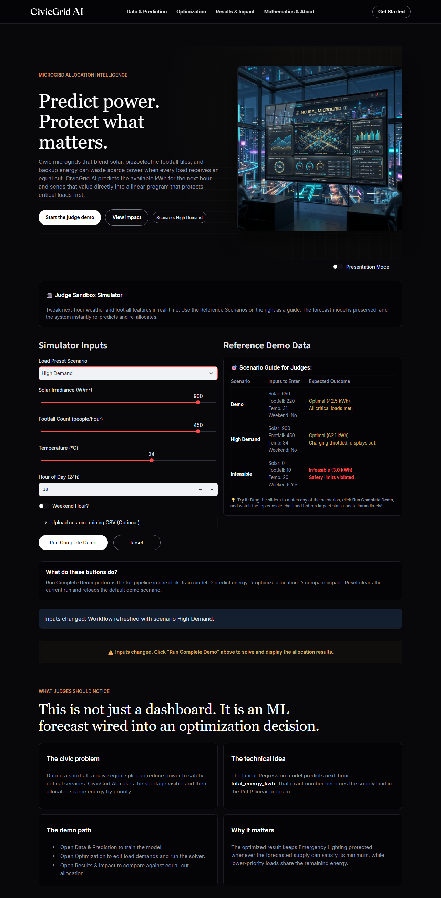
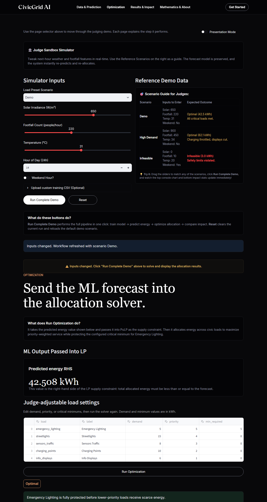
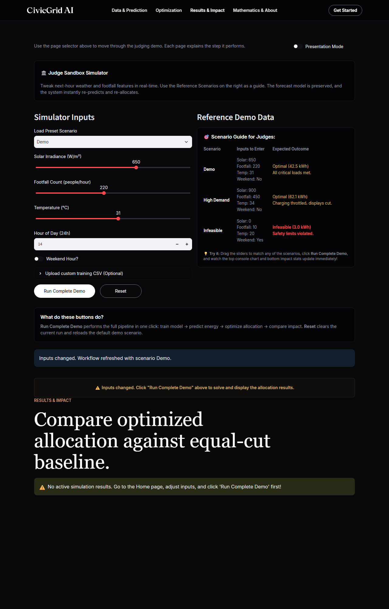

<p align="center">
  
</p>

<h1 align="center">CivicGrid AI</h1>
<p align="center">
  <strong>Predicting Power, Optimizing Impact.</strong>
</p>

<p align="center">
  <a href="#-judges-quick-start-guide-foolproof"><strong>Quick Start Guide</strong></a> •
  <a href="#-how-it-works-simplified"><strong>How It Works</strong></a> •
  <a href="#-visual-gallery"><strong>Visual Gallery</strong></a> •
  <a href="#-judgement-criteria-alignment"><strong>Judgement Criteria</strong></a>
</p>

---

Developed for **"The Optimizers (Predict & Optimize)"** inter-school competition.

* **School**: Indraprastha International School
* **Team**: The Optimizers
* **Participants**: Maayukh (Class IX) & Sherayansh (Class X)
* **Submission Date**: 11th July 2026

---

## ⚡ Project Overview

Modern urban microgrids utilize renewable energy (solar panels) and kinetic energy (piezoelectric footfall harvesting tiles). However, municipal grids traditionally split available energy **equally** across devices during shortfalls. This naive approach causes critical failures in public safety systems, dropping **Emergency Lighting** below its minimum operational threshold.

**CivicGrid AI** resolves this by using **Machine Learning** to forecast available energy for the next hour, then passing that forecast directly into a **Linear Programming (LP)** optimization engine. The LP model guarantees that safety-critical lower bounds (such as keeping Emergency Lighting at 100%) are met first, before distributing remaining energy to streetlights, sensors, charging stations, and public displays by utility priority.

---

## ⏱️ Judges' Quick Start Guide (Foolproof)

This section is designed to help you download, run, and test the CivicGrid AI software prototype in under 2 minutes.

### Step 1: Download & Open
1. **Download the code**: Either run `git clone https://github.com/nova-rishabh/civicgrid-ai.git` or [download the project as a ZIP file from GitHub and extract it.](https://www.youtube.com/watch?v=lw3bszX6ta8)
2. **Open the project folder**: Open the extracted folder on your computer.

### Step 2: Run the Application

#### Option A: One-Click Startup (Windows - Recommended)
Simply **double-click the `run_app.bat` file** in the project root folder.
* *What this script does automatically for you:*
  1. Creates a Python virtual environment (`.venv`).
  2. Installs all required packages from `requirements.txt`.
  3. Generates the synthetic datasets and trains the ML model.
  4. Runs the automated test suite to verify math and constraints.
  5. Launches the web app and automatically opens it in your default web browser (`http://localhost:8503`).

#### Option B: Manual Setup (Windows / macOS / Linux)
If you are on macOS, Linux, or prefer running commands manually, execute these commands in your terminal:
```bash
# 1. Create and activate virtual environment
python -m venv .venv
# On Windows:
.venv\Scripts\activate
# On macOS/Linux:
source .venv/bin/activate

# 2. Install required libraries
pip install -r requirements.txt

# 3. Generate datasets and train the ML model
python src/data_generator.py

# 4. Run automated tests (Optional)
python -m pytest

# 5. Launch the Streamlit dashboard
streamlit run app.py
```
Open `http://localhost:8503` in your web browser.

---

## 🔍 Step-by-Step Judge Evaluation Guide

Follow this walkthrough to verify the mathematical and operational accuracy of CivicGrid AI:

1. **Verify Home Page & Preset Scenario**:
   * Open the dashboard.
   * Under **Judge Sandbox Simulator**, select the **High Demand** scenario from the dropdown. 
   * Notice that the results console disappears, showing the Neural Microgrid image. This proves that changing inputs immediately resets results.
   * Click the primary **Run Complete Demo** button.
   * Verify that the results console loads, showing a next-hour predicted available energy of **62.1 kWh**.
   * Verify that under **Live Simulation Output**, **Emergency Lighting** remains protected at **100%** (8.8/8.8 kWh), while lower-priority Info Displays are shed to **0%** (0.0/10.5 kWh) to keep the grid stable.

2. **Verify Machine Learning Forecast (Data & Prediction Tab)**:
   * Navigate to the **Data & Prediction** tab.
   * Click **Train Model**.
   * Confirm that the prediction for next-hour available energy under default settings is approximately **42.5 kWh**.
   * Review the $R^2$ accuracy score (exceeds **0.97**).

3. **Verify Optimization & Solver (Optimization Tab)**:
   * Navigate to the **Optimization** tab.
   * Verify that the predicted energy auto-fills, and click **Run Optimization**.
   * Verify that the solver status reads **Optimal**.

4. **Verify Comparative Social Impact (Results & Impact Tab)**:
   * Navigate to the **Results & Impact** tab.
   * Review the comparison: **Emergency Lighting Minimum Met** is **100%** with CivicGrid AI vs. **96.6%** with the equal-cut baseline. This confirms the safety-critical protection.

---

## 🧠 How It Works (Simplified)



1. **The Predictor (Machine Learning)**:
   A Linear Regression model analyzes current solar intensity, footfall counts, temperature, and day type to forecast exactly how much energy the microgrid will generate in the next hour:
   $$\hat{y} = 5.6 + 0.03 \cdot \text{Solar} + 0.05 \cdot \text{Footfall} + 0.2 \cdot \text{Temp} - 1.5 \cdot \text{Weekend}$$

2. **The Optimizer (Linear Programming)**:
   This predicted energy becomes the supply limit. PuLP solves a Linear Program to maximize the priority-weighted energy delivery:
   $$\text{Maximize } \sum (\text{Priority Weight}_j \times \text{Allocation}_j)$$
   while enforcing the critical constraint:
   $$\text{Allocation}_{\text{Emergency Lighting}} \ge \text{Minimum Required Safety Power (5.0 kWh)}$$

---

## 📸 Visual Gallery

### 1. Active Solved Simulation Dashboard
Mockup of the main simulator board showing successful prediction and optimization results:
<p align="center">
  
</p>

### 2. Live Interactive Sandbox Controls
Judges can modify features or presets; the system hides stale results until simulation runs again:
<p align="center">
  
</p>

### 3. Linear Programming Solver Details
Shows decision variables, status codes, and optimized allocations vs. total demand:
<p align="center">
  
</p>

### 4. Operational Comparison vs. Baseline
Comparative charts showing how CivicGrid AI meets critical safety bounds compared to equal proportional cuts:
<p align="center">
  
</p>

---

## 🏆 Judgement Criteria Alignment

* **Mathematical Accuracy & Depth**: Implements a multivariate Linear Regression model ($R^2 = 0.979$) directly coupled with a multi-variable simplex Linear Programming solver (PuLP/CBC).
* **Real-World Relevance & Social Impact**: Solves the real-world vulnerability of proportional grid failures, ensuring emergency lighting and traffic safety sensors remain online during blackouts.
* **Innovation and Creativity**: Seamlessly links machine learning forecasts directly into a constraint-bound optimization engine, built in a premium glassmorphic Streamlit interface.
* **Sustainability & Future Scope**: Maximizes renewable solar and kinetic footstep utilization, with future support for IoT SCADA system integrations.
